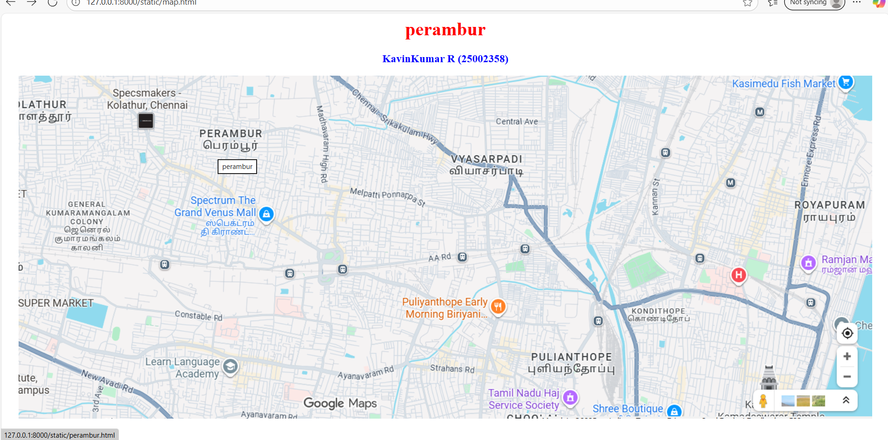
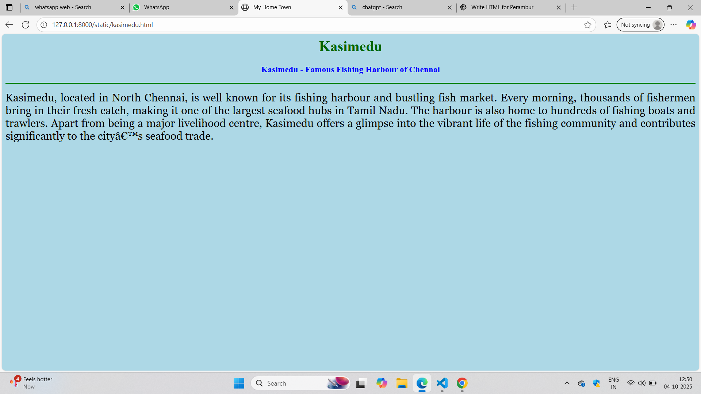
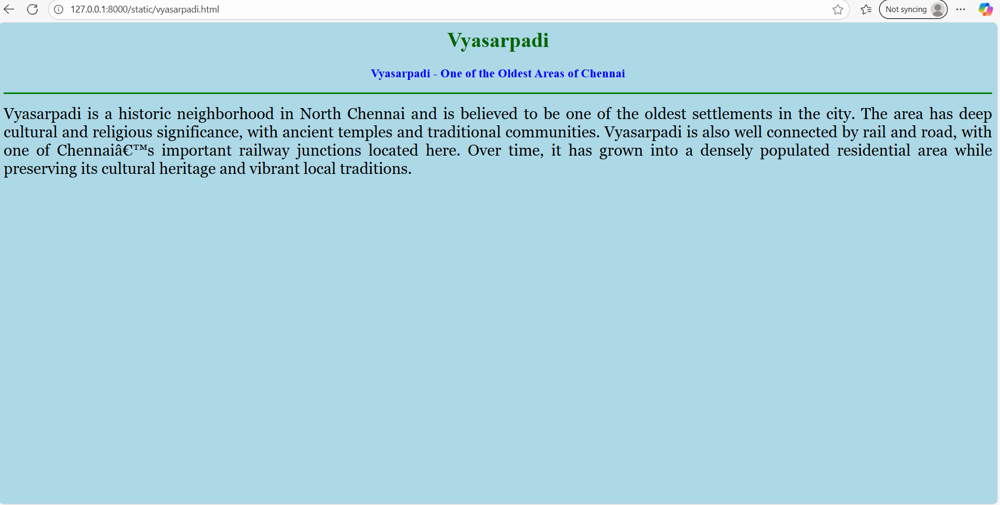
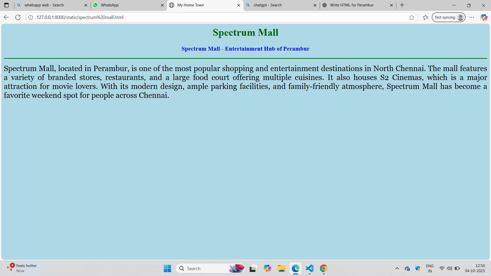
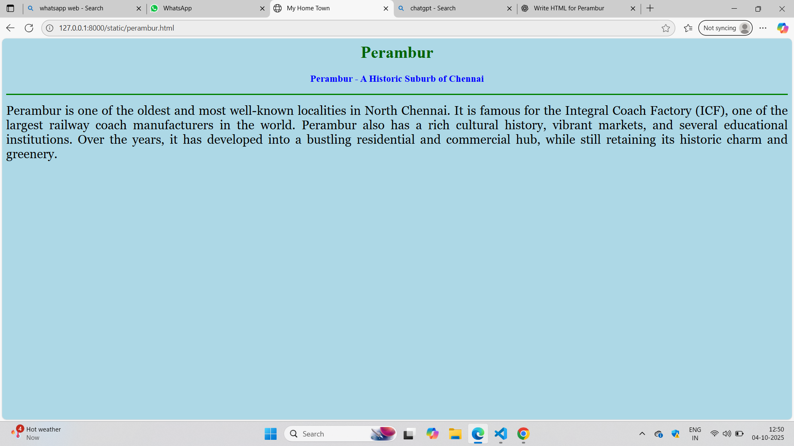

# Ex04 Places Around Me
# Date:04.10.2025
# AIM
To develop a website to display details about the places around my house.

# DESIGN STEPS
## STEP 1
Create a Django admin interface.

## STEP 2
Download your city map from Google.

## STEP 3
Using <map> tag name the map.

## STEP 4
Create clickable regions in the image using <area> tag.

## STEP 5
Write HTML programs for all the regions identified.

## STEP 6
Execute the programs and publish them.

# CODE
~~~
map.html

<html>
<head>
<title>My City</title>
</head>
<body>
<h1 align="center">
<b>perambur</b>
</h1>
<h3 align="center">
<b>KavinKumar R (25002358)</b>
</h3>

<!-- Image Map Generated by http://www.image-map.net/ -->

<map name="image-map">
    <area target="_self" alt="perambur" title="perambur" href="perambur.html" coords="275,62,484,187" shape="rect">
    <area target="_self" alt="vyasarpadi" title="vyasarpadi" href="vyasarpadi.html" coords="687,56,927,229" shape="rect">
    <area target="_self" alt="spectrum Grand venus mall" title="spectrum Grand venus mall" href="spectrum mall.html" coords="197,184,464,311" shape="rect">
    <area target="_self" alt="kasimedu fish market" title="kasimedu fish market" href="kasimedu.html" coords="1160,3,1447,105" shape="rect">

</map>

kasimedu.html

<html>
<head>
  <title>My Home Town</title>
</head>
<body bgcolor="lightblue">

  <h1 align="center">
    <b>Kasimedu</b>
  </h1>

  <h3 align="center">
    <b>Kasimedu - Famous Fishing Harbour of Chennai</b>
  </h3>

  

  

    
      Kasimedu, located in North Chennai, is well known for its fishing harbour and 
      bustling fish market. Every morning, thousands of fishermen bring in their fresh 
      catch, making it one of the largest seafood hubs in Tamil Nadu. The harbour is 
      also home to hundreds of fishing boats and trawlers. Apart from being a major 
      livelihood centre, Kasimedu offers a glimpse into the vibrant life of the fishing 
      community and contributes significantly to the city’s seafood trade.
    
  

</body>
</html>

perambur.html

<html>
<head>
  <title>My Home Town</title>
</head>
<body bgcolor="lightblue">

  <h1 align="center">
    <b>Perambur</b>
  </h1>

  <h3 align="center">
    <b>Perambur - A Historic Suburb of Chennai</b>
  </h3>

  

  

    
      Perambur is one of the oldest and most well-known localities in North Chennai. 
      It is famous for the Integral Coach Factory (ICF), one of the largest railway 
      coach manufacturers in the world. Perambur also has a rich cultural history, 
      vibrant markets, and several educational institutions. Over the years, it has 
      developed into a bustling residential and commercial hub, while still retaining 
      its historic charm and greenery.
    
  

</body>
</html>

spectrum mall.html

<html>
<head>
  <title>My Home Town</title>
</head>
<body bgcolor="lightblue">

  <h1 align="center">
    <b>Spectrum Mall</b>
  </h1>

  <h3 align="center">
    <b>Spectrum Mall - Entertainment Hub of Perambur</b>
  </h3>

  

  

    
      Spectrum Mall, located in Perambur, is one of the most popular shopping and 
      entertainment destinations in North Chennai. The mall features a variety of 
      branded stores, restaurants, and a large food court offering multiple cuisines. 
      It also houses S2 Cinemas, which is a major attraction for movie lovers. With 
      its modern design, ample parking facilities, and family-friendly atmosphere, 
      Spectrum Mall has become a favorite weekend spot for people across Chennai.
    
  

</body>
</html>

vyasarpadi.html

<html>
<head>
  <title>My Home Town</title>
</head>
<body bgcolor="lightblue">

  <h1 align="center">
    <b>Vyasarpadi</b>
  </h1>

  <h3 align="center">
    <b>Vyasarpadi - One of the Oldest Areas of Chennai</b>
  </h3>

  

  

    
      Vyasarpadi is a historic neighborhood in North Chennai and is believed to be one 
      of the oldest settlements in the city. The area has deep cultural and religious 
      significance, with ancient temples and traditional communities. Vyasarpadi is also 
      well connected by rail and road, with one of Chennai’s important railway junctions 
      located here. Over time, it has grown into a densely populated residential area 
      while preserving its cultural heritage and vibrant local traditions.
    
  

</body>
</html>

~~~

# OUTPUT

# RESULT
The program for implementing image maps using HTML is executed successfully.
